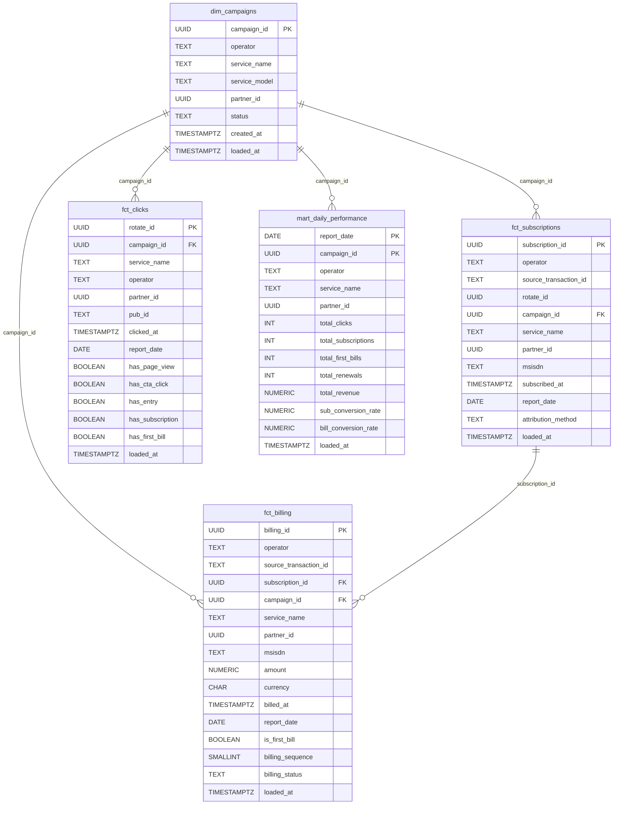

# DE Test — Part 2: Data Modeling

> Dataset: Mobile Advertising Platform | UK, January 2026
> Goal: Unified daily view of Subscriptions, First Bills, Revenue, and Conversion across 3 operators

---

## Star Schema Overview



### How to read this schema

This is a **modified star schema** — `dim_campaigns` sits at the center and every fact table joins to it via `campaign_id`. There is one additional relationship between `fct_subscriptions` and `fct_billing` (via `subscription_id`), which makes this slightly closer to a snowflake for that single link, but the overall shape and query pattern remain star-like.

**The 5 tables and their roles:**

| Table | Type | Grain | Purpose |
|-------|------|-------|---------|
| `dim_campaigns` | Dimension | 1 row per campaign | Single source of truth for operator, service, partner metadata |
| `fct_subscriptions` | Fact | 1 row per user opt-in event | Captures every subscription across all 3 operators, with attribution resolved |
| `fct_billing` | Fact | 1 row per successful charge | Tracks every revenue event; `is_first_bill` and `billing_sequence` enable cohort analysis |
| `fct_clicks` | Fact | 1 row per click | Enriched with pre-computed funnel flags (view → CTA → entry → sub → bill) |
| `mart_daily_performance` | Mart | 1 row per day × campaign | Pre-aggregated daily rollup for BI dashboards; refreshed nightly |

**Key design decisions visible in the schema:**

- `campaign_id` is denormalized into every fact table — slicing by operator / service / partner never requires a join back to `dim_campaigns`
- `rotate_id` in `fct_subscriptions` is nullable — operator_c cannot provide it directly; attribution is resolved via `tracking_code` lookup
- `attribution_method` records *how* each subscription was attributed — critical for debugging metric anomalies
- `is_first_bill` and `billing_sequence` are pre-computed at load time — dashboard queries use `WHERE is_first_bill = TRUE` instead of expensive window functions
- `report_date` is a STORED generated column on every fact table — enables fast date partitioning with zero overhead at query time

---

## 0. Design Thinking Before Writing Any DDL

Before touching the keyboard, answer these 4 questions:

| Question | Answer for this problem |
|----------|------------------------|
| **Who reads this data?** | Business / BI team — needs to slice by operator, service, partner |
| **What is the grain of each metric?** | Subscription = 1 row/user/service; Billing = 1 row/transaction; Click = 1 row/click |
| **What are the pain points in the source data?** | 3 operators, 3 different formats, 3 different ways to link back to a click |
| **What trade-offs are acceptable?** | Denormalize some dimensions to avoid multi-level joins at query time |

**Proposed Architecture: 3 Layers**

```
[RAW / STAGING]          [UNIFIED FACTS]             [AGGREGATED MART]
operator_a          ─┐
operator_b          ─┼──►  fct_subscriptions  ─┐
operator_c          ─┘      fct_billing        ─┼──►  mart_daily_performance
                            fct_clicks         ─┘
clicks / campaigns  ──►  dim_campaigns
```

- **Raw layer**: already exists — 7 source tables
- **Unified Facts**: normalizes and resolves attribution — this is the most critical layer
- **Mart**: pre-aggregates for dashboards / BI, refreshed daily

---

## 1. dim_campaigns — Core Dimension Table

### Why is this layer needed?

The source `campaigns` table already exists, but the fact tables will need to join it to retrieve `service_name`, `partner_id`, and `operator` — the 3 primary slice axes for this problem. Rather than forcing BI tools to join through 3–4 layers on every query, we create a clear dimension table that serves as the single source of truth for all campaign metadata.

### DDL

```sql
CREATE TABLE dim_campaigns (
    campaign_id    UUID        PRIMARY KEY,
    -- FK → campaigns.id; no surrogate key needed since UUID is already globally unique

    operator       TEXT        NOT NULL,
    -- 'operator_A' | 'operator_B' | 'operator_C'
    -- Denormalized directly here because operator is a fixed attribute of a campaign
    -- and never changes after the campaign is created.

    service_name   TEXT        NOT NULL,
    -- Service name — the most important slice axis for business reporting.
    -- Denormalized to avoid joining an additional external table.

    service_model  TEXT        NOT NULL,
    -- 'one-off' | 'subscription'
    -- Important for filtering: one-off services will not have REN / billing cycles

    partner_id     UUID        NOT NULL,
    -- Partner buying traffic — the 3rd slice axis as required.
    -- Kept as UUID, no partner table join since the dataset doesn't include one.

    status         TEXT        NOT NULL,
    -- 'active' | 'paused' | etc. — used to filter active campaigns

    created_at     TIMESTAMPTZ NOT NULL,
    -- Campaign creation date — useful for cohort analysis later

    loaded_at      TIMESTAMPTZ NOT NULL DEFAULT NOW()
    -- Audit column: records when this row was loaded into the mart
);
```

> **Design rationale — Why denormalize `service_name` and `operator` here?**
>
> In OLTP (transactional) systems, 100% normalization is correct — it avoids update anomalies.
> In OLAP / reporting layers, queries must run fast and stay simple. If a BI tool needs to join
> through 4 tables to find the `service_name` of a billing row, queries become slow and error-prone.
> The dimension table acts as a "pre-resolved lookup" — a small storage cost in exchange for
> query simplicity and performance.

---

## 2. fct_subscriptions — Central Fact Table

### Grain: 1 row = 1 opt-in event by 1 user for 1 service

This is the most important table. It must absorb subscription events from all 3 operators despite their completely different formats:

| Operator | Subscription event | Has rotate_id? |
|----------|--------------------|----------------|
| operator_a | `event_code = 1` | ✅ Always present |
| operator_b | `transaction_type = 'SUB'` | ✅ Always present |
| operator_c | `delivery_status = 'DELIVERED'` | ❌ Must look up via `tracking_code` |

### DDL

```sql
CREATE TABLE fct_subscriptions (
    subscription_id       UUID        PRIMARY KEY DEFAULT gen_random_uuid(),
    -- Surrogate key — important: do NOT use the operator's transaction_id as the PK
    -- because we may need to merge / dedup across operators later.
    -- gen_random_uuid() is native to Postgres; no extension required.

    operator              TEXT        NOT NULL,
    -- 'operator_A' | 'operator_B' | 'operator_C'
    -- Denormalized here so queries don't need an extra join when filtering by operator.

    source_transaction_id TEXT        NOT NULL,
    -- Original ID from the operator table: operator_a.transaction_id,
    -- operator_b.transaction_id, operator_c.message_id.
    -- Retained for auditing and tracing back to raw data.

    rotate_id             UUID,
    -- FK → clicks.rotate_id — NULLABLE because operator_c must first look up
    -- via tracking_code; if no match is found (expired or ambiguous), leave NULL.
    -- This is the "attribution field" — required for the conversion metric.

    campaign_id           UUID        NOT NULL REFERENCES dim_campaigns(campaign_id),
    -- Resolved from rotate_id → clicks.campaign_id.
    -- NOT NULL because every subscription must belong to a campaign.

    service_name          TEXT        NOT NULL,
    -- Denormalized from dim_campaigns — avoids a join when slicing by service.

    partner_id            UUID        NOT NULL,
    -- Denormalized from dim_campaigns — avoids a join when slicing by partner.

    msisdn                TEXT        NOT NULL,
    -- Phone number (anonymised in production).
    -- This is the real user identifier — used to link billing rows back here.

    subscribed_at         TIMESTAMPTZ NOT NULL,
    -- Opt-in timestamp — the most important field for daily aggregation.

    report_date           DATE        NOT NULL GENERATED ALWAYS AS (subscribed_at::DATE) STORED,
    -- Pre-computed date column for faster partitioning and GROUP BY.
    -- STORED = Postgres computes it once at insert time, not on every query.
    -- GENERATED AS ... STORED works because ::DATE is immutable (unlike INTERVAL).

    attribution_method    TEXT        NOT NULL,
    -- 'direct_rotate_id' | 'tracking_code_lookup' | 'unattributed'
    -- Records HOW attribution was resolved — critical for debugging
    -- and for giving the business a confidence level on reported numbers.

    loaded_at             TIMESTAMPTZ NOT NULL DEFAULT NOW()
);

CREATE INDEX idx_fct_sub_campaign_date  ON fct_subscriptions(campaign_id, report_date);
CREATE INDEX idx_fct_sub_msisdn         ON fct_subscriptions(msisdn);
CREATE INDEX idx_fct_sub_rotate_id      ON fct_subscriptions(rotate_id) WHERE rotate_id IS NOT NULL;
CREATE INDEX idx_fct_sub_report_date    ON fct_subscriptions(report_date);
-- Separate index on report_date because it is the most common filter column in daily reporting.
```

> **Design rationale — Why a surrogate key instead of the operator's transaction_id?**
>
> operator_a's `transaction_id` is a UUID, operator_b's is also a UUID, and operator_c uses
> `message_id`. If we used these directly as the PK, we could not have a single unified table
> (3 different namespaces that could theoretically collide). A surrogate key we generate ourselves
> makes the table truly unified. `source_transaction_id` retains the original ID for traceability.

> **Design rationale — Why the `attribution_method` column?**
>
> This is a column junior DEs often omit, but a senior DE will always add it.
> When the business asks "why did subscriptions jump 20% today?", without this column it is very
> hard to debug whether the increase reflects real growth or a change in attribution logic.
> It also enables filtering: "show only subscriptions with confident attribution (direct rotate_id)"
> to avoid inflated numbers.

---

## 3. fct_billing — Billing Transactions

### Grain: 1 row = 1 successful charge event

Unlike subscriptions (a one-time opt-in), billing is a recurring event. A user can be charged multiple times. This requires a separate table — embedding billing into `fct_subscriptions` would violate grain.

| Operator | Billing event | Amount |
|----------|--------------|--------|
| operator_a | `event_code = 2, status = 'SUCCESS'` | Present |
| operator_b | `transaction_type = 'REN', amount > 0` | Present |
| operator_c | `delivery_status = 'DELIVERED'` | No amount — subscription + charge occur as a single event |

### DDL

```sql
CREATE TABLE fct_billing (
    billing_id            UUID        PRIMARY KEY DEFAULT gen_random_uuid(),
    -- Surrogate key, same rationale as fct_subscriptions.

    operator              TEXT        NOT NULL,

    source_transaction_id TEXT        NOT NULL,
    -- Original operator ID for traceability.

    subscription_id       UUID        REFERENCES fct_subscriptions(subscription_id),
    -- FK back to fct_subscriptions — NULLABLE because operator_b REN rows have no
    -- rotate_id and must be linked via msisdn → SUB → subscription_id.
    -- If resolution fails (orphan billing), set NULL rather than dropping the row.

    campaign_id           UUID        NOT NULL REFERENCES dim_campaigns(campaign_id),
    -- Resolved from subscription_id → campaign_id. NOT NULL because revenue must
    -- always belong to a campaign so the business can slice by partner / service.

    service_name          TEXT        NOT NULL,
    partner_id            UUID        NOT NULL,
    -- Denormalized from dim_campaigns — same rationale as fct_subscriptions.

    msisdn                TEXT        NOT NULL,

    amount                NUMERIC(10,2) NOT NULL,
    currency              CHAR(3)       NOT NULL DEFAULT 'GBP',

    billed_at             TIMESTAMPTZ NOT NULL,
    report_date           DATE        NOT NULL GENERATED ALWAYS AS (billed_at::DATE) STORED,

    is_first_bill         BOOLEAN     NOT NULL DEFAULT FALSE,
    -- Pre-computed flag: TRUE if this is the first successful charge for this
    -- msisdn + service combination. Computed via ROW_NUMBER() at populate time.
    -- The "First Bill" metric required by the problem depends on this flag.

    billing_sequence      SMALLINT    NOT NULL DEFAULT 1,
    -- Ordinal position of the billing event for this msisdn + service:
    -- 1 = first, 2 = second, etc.
    -- Enables cohort analysis: "which billing cycle sees the most churn?"

    billing_status        TEXT        NOT NULL,
    -- 'SUCCESS' | 'FAILED' | 'PENDING'
    -- operator_c has no explicit status → DELIVERED implicitly maps to 'SUCCESS'.

    loaded_at             TIMESTAMPTZ NOT NULL DEFAULT NOW()
);

CREATE INDEX idx_fct_billing_campaign_date   ON fct_billing(campaign_id, report_date);
CREATE INDEX idx_fct_billing_subscription_id ON fct_billing(subscription_id) WHERE subscription_id IS NOT NULL;
CREATE INDEX idx_fct_billing_msisdn          ON fct_billing(msisdn);
CREATE INDEX idx_fct_billing_is_first_bill   ON fct_billing(report_date) WHERE is_first_bill = TRUE;
-- Partial index on first bill because it is an extremely common filter
-- but only ~15–20% of rows qualify.
```

> **Design rationale — Why is `is_first_bill` a pre-computed flag rather than a runtime calculation?**
>
> It can be computed at query time using:
> ```sql
> ROW_NUMBER() OVER (PARTITION BY msisdn, service_name ORDER BY billed_at) = 1
> ```
> However, every query would scan the entire billing table to compute the window function —
> very expensive as data grows. Pre-computing once at load time and storing a flag means queries
> only need `WHERE is_first_bill = TRUE`. Trade-off: if historical data is reprocessed
> (late-arriving rows), the flag must be recalculated. This is an acceptable trade-off because
> first-bill is a stable metric and rarely requires recomputation.

> **Design rationale — Why `billing_sequence` instead of just `is_first_bill`?**
>
> `is_first_bill` answers today's question. `billing_sequence` answers future questions:
> "average lifetime value", "churn at which billing cycle". Adding 2 bytes of SMALLINT now
> is far cheaper than migrating the schema after the table has millions of rows.

---

## 4. fct_clicks — Enriched Click Table

### Grain: 1 row = 1 click (unchanged from the source table)

The source `clicks` table already has the correct grain. This is an enriched version with pre-computed flags for calculating conversion metrics.

```sql
CREATE TABLE fct_clicks (
    rotate_id             UUID        PRIMARY KEY,
    -- Retained from clicks.rotate_id — this is the natural key for a click.

    campaign_id           UUID        NOT NULL REFERENCES dim_campaigns(campaign_id),
    service_name          TEXT        NOT NULL,
    operator              TEXT        NOT NULL,
    partner_id            UUID        NOT NULL,
    -- All denormalized from dim_campaigns — because this is the base table for
    -- conversion metrics, it must be sliceable without any additional joins.

    pub_id                TEXT,
    -- Publisher ID — retained from clicks. Nullable because some clicks lack this.

    clicked_at            TIMESTAMPTZ NOT NULL,
    report_date           DATE        NOT NULL GENERATED ALWAYS AS (clicked_at::DATE) STORED,

    -- === CONVERSION FLAGS ===
    has_page_view         BOOLEAN     NOT NULL DEFAULT FALSE,
    -- TRUE if at least 1 page_events row with event_type='VIEW' exists for this rotate_id.

    has_cta_click         BOOLEAN     NOT NULL DEFAULT FALSE,
    -- TRUE if a 'CLICK_CTA' page_event exists — user interacted with the subscribe button.

    has_entry             BOOLEAN     NOT NULL DEFAULT FALSE,
    -- TRUE if an 'ENTRY' page_event exists — user entered their information (msisdn).

    has_subscription      BOOLEAN     NOT NULL DEFAULT FALSE,
    -- TRUE if a row exists in fct_subscriptions with this rotate_id.

    has_first_bill        BOOLEAN     NOT NULL DEFAULT FALSE,
    -- TRUE if the associated subscription has had a successful first charge.
    -- This is the final conversion metric — "paying subscriber".

    loaded_at             TIMESTAMPTZ NOT NULL DEFAULT NOW()
);

CREATE INDEX idx_fct_clicks_campaign_date ON fct_clicks(campaign_id, report_date);
CREATE INDEX idx_fct_clicks_pub_id        ON fct_clicks(pub_id) WHERE pub_id IS NOT NULL;
CREATE INDEX idx_fct_clicks_report_date   ON fct_clicks(report_date);
```

> **Design rationale — Why pre-computed funnel flags instead of runtime joins against page_events?**
>
> The most common conversion question is: "What is the click-to-subscription rate for campaign X
> this week?" Computing this at runtime requires joining fct_clicks → page_events → fct_subscriptions
> and then GROUP BY. Over a month of data, this query can take several seconds. With pre-computed
> flags, the query becomes:
> `SELECT SUM(has_subscription::INT) * 1.0 / COUNT(*) FROM fct_clicks WHERE report_date BETWEEN ...
> AND campaign_id = ...` — extremely fast.
>
> Trade-off: whenever late-arriving subscription data is received, fct_clicks must be updated.
> This is an infrequent case and can be handled by a batch job.

---

## 5. mart_daily_performance — Pre-Aggregated Reporting Mart

### Grain: 1 row = 1 day × 1 campaign × 1 operator × 1 service × 1 partner

This is the final table that BI tools (Looker, Tableau, Metabase) read from. Refreshed daily after all fact tables have been loaded.

```sql
CREATE TABLE mart_daily_performance (
    report_date           DATE        NOT NULL,
    campaign_id           UUID        NOT NULL REFERENCES dim_campaigns(campaign_id),
    operator              TEXT        NOT NULL,
    service_name          TEXT        NOT NULL,
    partner_id            UUID        NOT NULL,

    -- === VOLUME ===
    total_clicks          INT         NOT NULL DEFAULT 0,
    total_page_views      INT         NOT NULL DEFAULT 0,
    total_cta_clicks      INT         NOT NULL DEFAULT 0,
    total_entries         INT         NOT NULL DEFAULT 0,

    -- === SUBSCRIPTION METRICS ===
    total_subscriptions   INT         NOT NULL DEFAULT 0,
    -- Count of distinct users who subscribed on this day.

    -- === BILLING METRICS ===
    total_first_bills     INT         NOT NULL DEFAULT 0,
    -- Count of subscriptions with a successful first charge on this day.

    total_renewals        INT         NOT NULL DEFAULT 0,
    -- Count of operator_b REN + operator_a event_code=2 from the 2nd charge onward.

    -- === REVENUE ===
    total_revenue         NUMERIC(12,4) NOT NULL DEFAULT 0,
    currency              CHAR(3)       NOT NULL DEFAULT 'GBP',
    -- Includes only amounts from SUCCESSFUL billing events.

    -- === CONVERSION RATES ===
    -- Pre-computed so BI tools don't need to handle division-by-zero risk.
    sub_conversion_rate   NUMERIC(8,6),
    -- total_subscriptions / NULLIF(total_clicks, 0)
    -- NULLIF prevents division by zero when there are no clicks on a given day.

    bill_conversion_rate  NUMERIC(8,6),
    -- total_first_bills / NULLIF(total_clicks, 0)

    PRIMARY KEY (report_date, campaign_id),

    loaded_at             TIMESTAMPTZ NOT NULL DEFAULT NOW()
);

CREATE INDEX idx_mart_daily_date       ON mart_daily_performance(report_date);
CREATE INDEX idx_mart_daily_operator   ON mart_daily_performance(operator, report_date);
CREATE INDEX idx_mart_daily_partner    ON mart_daily_performance(partner_id, report_date);
CREATE INDEX idx_mart_daily_service    ON mart_daily_performance(service_name, report_date);
```

> **Design rationale — Why have a mart layer when fact tables already exist?**
>
> Fact tables have fine grain (row-level). Dashboards need aggregations. There are 2 options:
>
> - **Option A**: BI tool aggregates from fact tables on every dashboard load.
>   → Flexible but slow as data scales. BI tools typically don't optimize this well.
>
> - **Option B**: Pre-aggregate once per night into the mart table.
>   → Fast and stable, but requires an additional maintenance job. The dashboard becomes
>   simply: `SELECT * FROM mart_daily_performance WHERE report_date = CURRENT_DATE - 1`.
>
> For this problem (daily metrics), Option B is clearly the better fit. The mart table also
> makes it straightforward to expose data externally (API, Google Sheets export) without
> performance concerns.

---

## 6. Attribution Logic — The Hardest Part of the Design

This is the section an interviewer will probe most deeply. A clear explanation is essential.

### How is `fct_subscriptions.rotate_id` populated?

```
operator_a (event_code=1):
    rotate_id is present → Direct insert, attribution_method = 'direct_rotate_id'

operator_b (transaction_type='SUB'):
    rotate_id is present → Direct insert, attribution_method = 'direct_rotate_id'

operator_c (delivery_status='DELIVERED'):
    No rotate_id. Must look up:
    operator_c.tracking_code
        → JOIN tracking_codes tc ON tc.code = operator_c.tracking_code
           AND operator_c.received_time BETWEEN tc.created_at AND tc.expired_at
        → tc.rotate_id
    If found: attribution_method = 'tracking_code_lookup'
    If not found (expired or multiple matches): attribution_method = 'unattributed'
```

### How is `fct_billing.subscription_id` populated for operator_b REN events?

```sql
-- operator_b REN rows have no rotate_id, only msisdn.
-- Chain: REN.msisdn → SUB row with same msisdn → subscription_id

UPDATE fct_billing b
SET subscription_id = sub.subscription_id
FROM fct_subscriptions sub
WHERE b.operator = 'operator_B'
  AND b.source_event_type = 'REN'
  AND b.msisdn = sub.msisdn
  AND sub.operator = 'operator_B'
  AND sub.subscribed_at <= b.billed_at;
-- Time condition: a billing event can only follow a subscription
```

> **Important edge case**: If a user unsubscribes and resubscribes, there may be 2 SUB rows for
> the same msisdn. We must take the most recent SUB before the billing event:
> ```sql
> AND sub.subscribed_at = (
>     SELECT MAX(subscribed_at) FROM fct_subscriptions
>     WHERE msisdn = b.msisdn AND operator = 'operator_B'
>     AND subscribed_at <= b.billed_at
> )
> ```

---

## 7. Final Entity Relationship Diagram

```
dim_campaigns
    │  (campaign_id)
    ├──◄── fct_clicks ────────────── (conversion funnel flags)
    │         │ (rotate_id)
    │         │
    ├──◄── fct_subscriptions ──────── (msisdn, attribution_method)
    │         │ (subscription_id)
    │         │
    └──◄── fct_billing ────────────── (is_first_bill, billing_sequence, amount)

All three ──► mart_daily_performance  (pre-aggregated daily)
```

---

## 8. Trade-offs

### Strengths of this design

| Strength | Explanation |
|----------|-------------|
| **Single source of truth** | All operators are normalized into a single unified schema |
| **Traceable attribution** | `attribution_method` + `source_transaction_id` → complete audit trail |
| **Query-friendly** | Denormalized dimension keys → slice by operator / service / partner without joins |
| **Pre-computed flags** | `is_first_bill`, `has_subscription`, `billing_sequence` → fast dashboard queries |
| **Extensible grain** | Fine grain at the fact layer → can re-aggregate along any dimension later |

### Weaknesses / when this design struggles

| Scenario | Problem | Mitigation |
|----------|---------|-----------|
| **Adding operator_D** | Must write additional ETL populate logic. Schema itself does not change. | Schema is already extensible — only add a new ETL job |
| **Operator changes format** | `source_transaction_id` + `attribution_method` help isolate the impact | Re-run ETL for that operator; no impact on others |
| **Late-arriving billing data** | `is_first_bill` and `billing_sequence` must be recalculated | Trigger or scheduled recalculation job for affected msisdns |
| **User resubscribes** | Attribution logic becomes more complex (2 SUB rows for the same msisdn) | The `MAX(subscribed_at) <= billed_at` condition already handles this |
| **Denormalization inconsistency** | If a campaign changes `partner_id` after fact rows already exist | Campaign attributes in practice never change once a campaign is active — a safe assumption for mobile ads |
| **Stale mart data** | `mart_daily_performance` is only fresh after ETL runs | Enforce SLA: mart available before 8 AM daily; for real-time needs, query fact tables directly |

### When would this design need to be rebuilt?

- **Real-time reporting** (< 1 minute latency): the mart pattern is not fast enough. Would need to shift to event streaming (Kafka → Flink → materialized view).
- **Multi-currency revenue** (if expanding beyond GBP): would need a `dim_exchange_rates` table and `amount_usd` computed at load time.
- **Data volume increases 100×**: `fct_billing` and `fct_clicks` would need partitioning by `report_date` for effective query pruning. The current DDL already has `report_date` as a STORED generated column — only `PARTITION BY RANGE (report_date)` needs to be added.

---

## 9. Sample SQL to Verify the Design

### Subscriptions per day per operator

```sql
SELECT
    report_date,
    operator,
    service_name,
    partner_id,
    COUNT(*)  AS total_subscriptions
FROM fct_subscriptions
WHERE report_date BETWEEN '2026-01-01' AND '2026-01-31'
GROUP BY 1, 2, 3, 4
ORDER BY 1, 2;
```

### Revenue per day per partner

```sql
SELECT
    report_date,
    partner_id,
    service_name,
    SUM(amount)              AS total_revenue,
    COUNT(*)                 AS total_charges,
    SUM(is_first_bill::INT)  AS first_bills
FROM fct_billing
WHERE billing_status = 'SUCCESS'
  AND report_date BETWEEN '2026-01-01' AND '2026-01-31'
GROUP BY 1, 2, 3
ORDER BY 1, total_revenue DESC;
```

### Conversion funnel per campaign

```sql
SELECT
    c.campaign_id,
    c.operator,
    c.service_name,
    COUNT(*)                                                AS total_clicks,
    SUM(has_page_view::INT)                                 AS reached_view,
    SUM(has_entry::INT)                                     AS reached_entry,
    SUM(has_subscription::INT)                              AS subscribed,
    SUM(has_first_bill::INT)                                AS first_billed,
    ROUND(100.0 * SUM(has_subscription::INT) / COUNT(*), 2) AS sub_rate_pct,
    ROUND(100.0 * SUM(has_first_bill::INT)   / COUNT(*), 2) AS bill_rate_pct
FROM fct_clicks c
WHERE report_date BETWEEN '2026-01-01' AND '2026-01-31'
GROUP BY 1, 2, 3
ORDER BY sub_rate_pct DESC;
```

### Daily summary from mart (for dashboard)

```sql
SELECT
    report_date,
    operator,
    SUM(total_subscriptions)  AS subscriptions,
    SUM(total_first_bills)    AS first_bills,
    SUM(total_revenue)        AS revenue,
    ROUND(AVG(sub_conversion_rate) * 100, 2) AS avg_sub_conv_pct
FROM mart_daily_performance
WHERE report_date = CURRENT_DATE - 1
GROUP BY 1, 2
ORDER BY 1, 2;
```

---

*End of Part 2 — Data Modeling*
