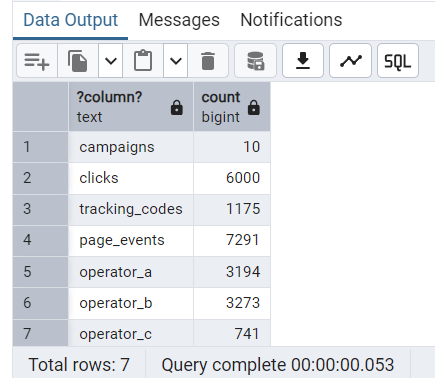

Context dataset

campaigns.csv           10 rows
clicks.csv           6,000 rows
tracking_codes.csv   1,175 rows
page_events.csv      7,291 rows
operator_A.csv       3,194 rows
operator_B.csv       3,273 rows
operator_C.csv         741 rows

Period: January 2026 | Country: GB | Currency: GBP

0.1 DDL — Create table PostgreSQL

DROP TABLE IF EXISTS campaigns CASCADE;
CREATE TABLE campaigns (
    id          UUID        PRIMARY KEY,
    country     CHAR(2)     NOT NULL DEFAULT 'GB',
    operator    TEXT        NOT NULL CHECK (operator IN ('operator_A', 'operator_B', 'operator_C')),
    service_name TEXT       NOT NULL,
    service_model TEXT      NOT NULL CHECK (service_model IN ('one-off', 'subscription')),
    partner_id  UUID        NOT NULL,
    status      TEXT        NOT NULL,
    created_at  TIMESTAMPTZ NOT NULL
);

-- =========================
-- clicks
-- =========================
DROP TABLE IF EXISTS clicks CASCADE;
CREATE TABLE clicks (
    rotate_id       UUID        PRIMARY KEY,
    campaign_id     UUID        NOT NULL REFERENCES campaigns(id),
    received_time   TIMESTAMPTZ NOT NULL,
    pub_id          TEXT
);

-- =========================
-- tracking_codes
-- =========================
DROP TABLE IF EXISTS tracking_codes CASCADE;
CREATE TABLE tracking_codes (
    rotate_id   UUID        NOT NULL REFERENCES clicks(rotate_id),
    code        CHAR(3)     NOT NULL,
    service_id  TEXT        NOT NULL,
    created_at  TIMESTAMPTZ NOT NULL,
    expired_at  TIMESTAMPTZ NOT NULL GENERATED ALWAYS AS (created_at + INTERVAL '30 minutes') STORED,
    PRIMARY KEY (rotate_id, code)
);

CREATE INDEX idx_tracking_codes_code ON tracking_codes(code);

-- =========================
-- page_events
-- =========================
DROP TABLE IF EXISTS page_events CASCADE;
CREATE TABLE page_events (
    event_id        UUID        PRIMARY KEY,
    rotate_id       UUID        NOT NULL REFERENCES clicks(rotate_id),
    campaign_id     UUID        NOT NULL REFERENCES campaigns(id),
    event_type      TEXT        NOT NULL CHECK (event_type IN ('VIEW', 'CLICK_CTA', 'ENTRY')),
    received_time   TIMESTAMPTZ NOT NULL,
    msisdn          TEXT,       -- NULL khi event_type != 'ENTRY'
    device_type     TEXT        CHECK (device_type IN ('mobile', 'desktop', 'tablet'))
);

CREATE INDEX idx_page_events_rotate_id ON page_events(rotate_id);
CREATE INDEX idx_page_events_campaign_id ON page_events(campaign_id);

-- =========================
-- operator_a
-- =========================
DROP TABLE IF EXISTS operator_a CASCADE;
CREATE TABLE operator_a (
    transaction_id  UUID        PRIMARY KEY,
    rotate_id       UUID        NOT NULL REFERENCES clicks(rotate_id),
    msisdn          TEXT        NOT NULL,
    received_time   TIMESTAMPTZ NOT NULL,
    event_code      SMALLINT    NOT NULL CHECK (event_code IN (1, 2, 3)),
    -- 1 = subscribe, 2 = bill, 3 = unsubscribe
    status          TEXT        NOT NULL CHECK (status IN ('SUCCESS', 'FAILED', 'PENDING')),
    amount          NUMERIC(10,2) NOT NULL DEFAULT 0,
    currency        CHAR(3)     NOT NULL DEFAULT 'GBP'
);

CREATE INDEX idx_operator_a_rotate_id ON operator_a(rotate_id);
CREATE INDEX idx_operator_a_msisdn    ON operator_a(msisdn);

-- =========================
-- operator_b
-- =========================
DROP TABLE IF EXISTS operator_b CASCADE;
CREATE TABLE operator_b (
    transaction_id      UUID        PRIMARY KEY,
    rotate_id           UUID        REFERENCES clicks(rotate_id),
    -- NULL cho REN và UNSUB rows; chỉ có ở SUB rows
    msisdn              TEXT        NOT NULL,
    received_time       TIMESTAMPTZ NOT NULL,
    transaction_type    TEXT        NOT NULL CHECK (transaction_type IN ('SUB', 'REN', 'UNSUB')),
    -- SUB = opt-in (no charge), REN = weekly charge, UNSUB = cancelled
    package_id          TEXT,
    amount              NUMERIC(10,2) NOT NULL DEFAULT 0,
    currency            CHAR(3)     NOT NULL DEFAULT 'GBP'
);

CREATE INDEX idx_operator_b_rotate_id ON operator_b(rotate_id) WHERE rotate_id IS NOT NULL;
CREATE INDEX idx_operator_b_msisdn    ON operator_b(msisdn);

-- =========================
-- operator_c
-- =========================
DROP TABLE IF EXISTS operator_c CASCADE;
CREATE TABLE operator_c (
    message_id      UUID        PRIMARY KEY,
    msisdn          TEXT        NOT NULL,
    received_time   TIMESTAMPTZ NOT NULL,
    tracking_code   TEXT        NOT NULL,
    -- join to tracking_codes.code; user-submitted qua SMS nên có thể sai
    service_id      TEXT        NOT NULL,
    delivery_status TEXT        NOT NULL CHECK (delivery_status IN ('DELIVERED', 'SMSC_QUEUED', 'FAILED'))
    -- DELIVERED = subscription + charge xảy ra cùng lúc
);

CREATE INDEX idx_operator_c_tracking_code ON operator_c(tracking_code);
CREATE INDEX idx_operator_c_msisdn        ON operator_c(msisdn);

0.2 Load data from CSV into PostgreSQL
Step (FK dependency)

1. campaigns          ← PK ID
2. clicks             ← FK → campaigns
3. tracking_codes     ← FK → clicks
4. page_events        ← FK → clicks, campaigns
5. operator_a         ← FK → clicks
6. operator_b         ← FK → clicks (nullable)
7. operator_c         ← non fk directly

** \COPY in psql **

\COPY campaigns(id,country,operator,service_name,service_model,partner_id,status,created_at)
FROM '/path/to/campaigns.csv' WITH (FORMAT csv, HEADER true, NULL '');

\COPY clicks(rotate_id,campaign_id,received_time,pub_id)
FROM '/path/to/clicks.csv' WITH (FORMAT csv, HEADER true, NULL '');

\COPY tracking_codes(rotate_id,code,service_id,created_at,expired_at)
FROM '/path/to/tracking_codes.csv' WITH (FORMAT csv, HEADER true, NULL '');

\COPY page_events(event_id,rotate_id,campaign_id,event_type,received_time,msisdn,device_type)
FROM '/path/to/page_events.csv' WITH (FORMAT csv, HEADER true, NULL '');

\COPY operator_a(transaction_id,rotate_id,msisdn,received_time,event_code,status,amount,currency)
FROM '/path/to/operator_A.csv' WITH (FORMAT csv, HEADER true, NULL '');

\COPY operator_b(transaction_id,rotate_id,msisdn,received_time,transaction_type,package_id,amount,currency)
FROM '/path/to/operator_B.csv' WITH (FORMAT csv, HEADER true, NULL '');

\COPY operator_c(message_id,msisdn,received_time,tracking_code,service_id,delivery_status)
FROM '/path/to/operator_C.csv' WITH (FORMAT csv, HEADER true, NULL '');

Double check data inserted into table
SELECT 'campaigns'    , COUNT(*) FROM campaigns
UNION ALL SELECT 'clicks'        , COUNT(*) FROM clicks
UNION ALL SELECT 'tracking_codes', COUNT(*) FROM tracking_codes
UNION ALL SELECT 'page_events'   , COUNT(*) FROM page_events
UNION ALL SELECT 'operator_a'    , COUNT(*) FROM operator_a
UNION ALL SELECT 'operator_b'    , COUNT(*) FROM operator_b
UNION ALL SELECT 'operator_c'    , COUNT(*) FROM operator_c;

 